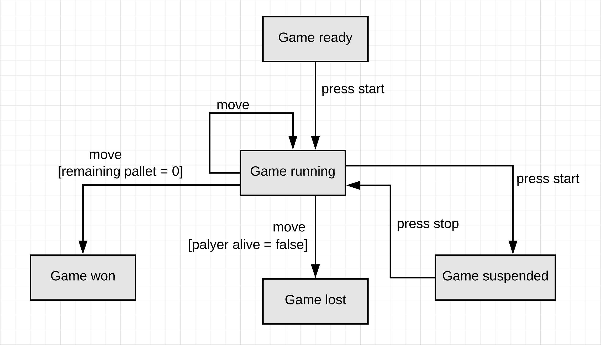
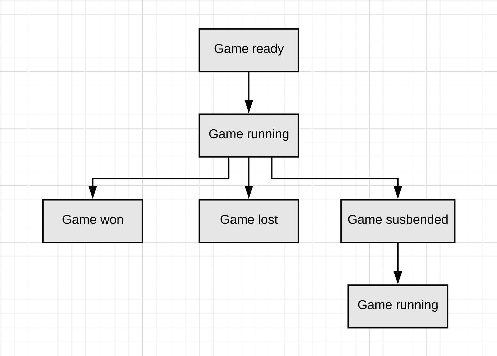
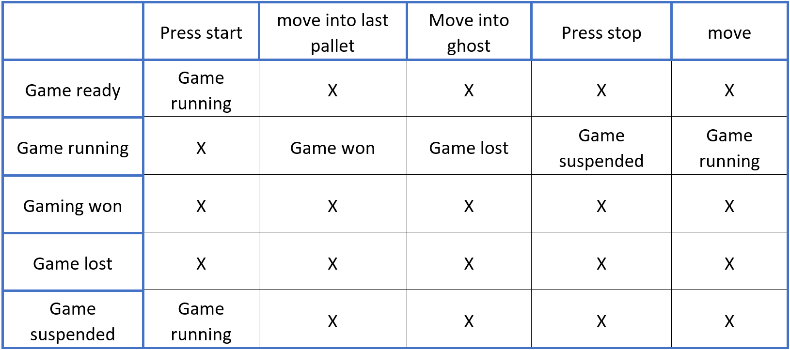
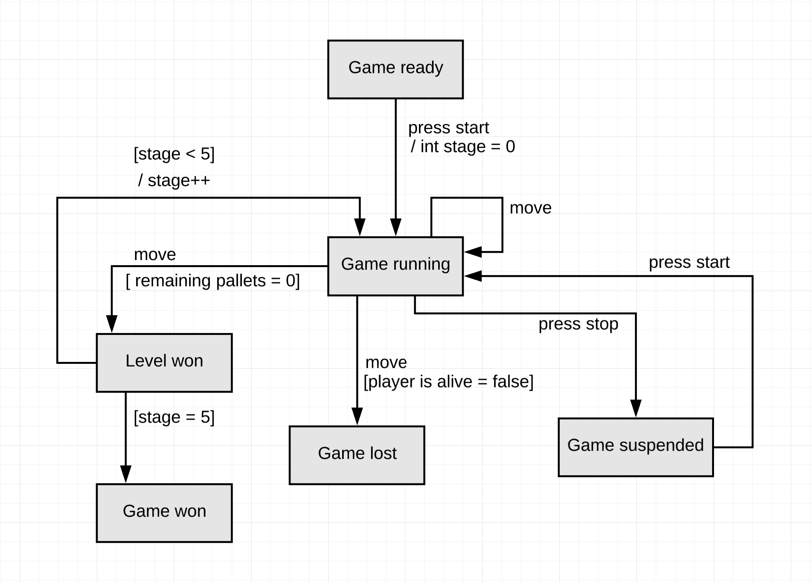

#JPacman report

#Part 0 + 1

##Ex 3
There is no enough time in the span life of the humanity to test all the cases of even simple code snippet.
As alternative to exhaustively test, the main cases for sure should be tested, but also all the edge cases
where the software can go wrong. These corner cases can happen due to non-expected use cases of the tested software.

##Ex 4
It is about being falsely-confident with the result if all the test are passed after doing 
some iteration to the software. These iterations can be either new changes to the well-tested software 
or fixing an existing bug. After each change new bug can be introduced which where not thought about 
in the excising tests. Shortly, repeating the same test case will not help finding new bugs.

##Ex 5
because machine can preforms more accurate than the human in test execution. Not to mention, executing tests 
is boring task to humans and takes so much time, while machines can do that order of magnitudes faster and 
will never feel tiered nor bored. Also, testers will have more time to think about corner cases.

##Ex 6 
Game class, gamewon(); is not tested, because the game is not won.
Empty Spirit class, is at 0% because the empty spirit is never used in the test 

##Ex  7 
yes the method was invoked during the test 

After commenting out the move method call, the test failed , the cause was assertion failure at line 77 when checking if the players score was 60 , using this information we get closer to locating the bug
however since all assertions where in one test method it's more difficult to locate the cause of the failure.

##Ex 8
changing the direction class broke the movement in the game by making all possible movements only up or down. This lead to the test failing.

##Ex 9
The unit class represents all the elements that could be interacted with such as NPC and the player, those unites are distributed on the board, since it contains and manages all the squares that could possibly be occupied , the level class is responsible of initializing the unites and locating them on the board and it also controls the games logic, such as npcs and detecting when the game is won / lost, it also handles the observes the monitor the game status.
The game class is responsible of starting and stopping the game also the player movement method that invokes the movement in the level class and the method that checks if the player has gotten a pellet   players score 

##Ex 12
Boundaries for X
At 0 : on point x = 0   (in point)      , off point X = -1  (off point)  
At  width : on point x = width  (off point)    , off point X = width - 1 (in point)

Boundaries for Y
At 0 : on point y = 0    (in point)     , off point y = -1 (off point)  
At  hight: on point y =  hight  (off point)   , off point y = hight - 1  (in point) 

The Only true outcome should occur iff :        0 <= x < width and 0 <= y < hight

##Ex 14
We can avoid repetition by using the @BeforeEach / @BeforeAll for setting up the tests, also the parameterized test to do the same test but with different inputs.

##Ex 15
But having a new set of objects before every test we can avoid having some tests affecting the result of the other tests. Doing so help running all the tests in Isolation from each other

##Ex  16
Using different type of assertions according to the context help in multiple ways such readability as well as in case of a failure some assertions provide better error messages than others,
In case of the assertequals(a , 1) in case of a failure we would get the actual value of a making it easier to debug the program , on the other hand assertTrue(a == 1) would return either true or false without giving the actual value in case of a fail, this would not be as easy to debug.

##Ex 17
Private methods cannot be tested normally, usually there is no need to test those methods because they are testing while testing the other components of the program, usually those private methods are fundamental for the functionality of the program and any bug would appear during the testing of the public methods or during the integration testing.

However there are some ways to test private methods such as nested test class or refections

___

#Part 2

##Ex 3
After writing the tests , we got a 100% branch coverage  in the Game.start() method and 100% branch coverage in the Game class.

##Ex 4
|        | Player          | Ghost          | Pellet          |
|--------|-----------------|----------------|-----------------|
| Player | Nothing happen  | Player dies    | Pellet consumed |
| Ghost  | Player dies     | Nothing happen | Nothing happen  |
| Pellet | Pellet consumed | Nothing happen | Nothing happen  |

##Ex 7
For the original tests we had 100% branch coverage in the class playerCollisions, after testing both classes in parallel, We where able to get 100% in both playerCollision and DefaultPlayerInteractionMap and 83% in Collison interaction map.

##Ex 8
One way that makes testing a lot easier is to use the Random generator as a dependency (passing it as a parameter instead of initializing it in the method) aka (dependency injection) then when we are going to test the method we can use a Fake/Mocked random generator which we can control its output, That removes the randomness from the test, while keeping it in the real code.

##Ex 9
The test is flaky because it relies on the ghost being in a specific position in order for it to kill the player. But since the ghost movements has randomness in them its possible that we might reach a state where the test fails.
We can avoid the randomness buy using a ghost that has predictable movement, this could be done by mocking a ghost the has a predictable randomMove() or design the test so that the ghosts only need to use the nextAIMove() method instead of the randomMove() method , doing that we can predict where a certain ghost always will be and move packman accordingly.

##Ex 10
Having 100% coverage is a good idea for small projects, because testing everything would help find more bugs if then exist, however some projects are too lager to be 100% tested, therefore its better to follow another test strategy such risk based testing.

##Ex 11
Using mocks would help testing unit tests , using mocks provides better controllability and observability, using mocks also helps to reduce the complexity of the tests are mocking an object is easier.  Wit mocks its also possible to control the behavior of the dependencies to test un expected situations.
A disadvantage of mocking is that with mocking we don’t test the actual interaction of our classes, that’s why we do integration testing as well as unit testing.

##Ex 12
A test that uses large loops or has high complexity. Also sometimes the tests include database access or they a really complex object, this could be solved by mocking but more tests need to be done later during the integration tests.	

##Ex 13
While testing how all the classes interact with each other as well as how the application interacts with whole system. With requires using the actual classes and not mocking them. (during system and integration testing)

##Ex 14
true true SOUTH SOUTH 159 188
true true SOUTH WEST 159 188
true true WEST EAST 158 -2147483451
true true EAST NORTH 158 -2147483451
true true NORTH NORTH 158 -2147483451 

the player when he consumed 15+ pellets and is facing to the west: an integer overflow occurs meaning a lager number of points was added.

##Ex 15
true true SOUTH NORTH 173 50
true true NORTH EAST 173 50
true true EAST NORTH 172 60
true true NORTH NORTH 171 70
true true NORTH SOUTH 170 65 
player lost 15 points after a certain number of pellets was consumed.

true true NORTH SOUTH 144 234
true true NORTH NORH 144 234
Game crashed after player is facing Up and has consumer some number of points.

##EX 16
The static analysis test does not detected an issues as the code is dynamically loading during run time.

##Ex 17 
1. Run untrusted code in its own thread. Set a SecurityManager on that thread by creating a subclass of SecurityManager and overrides checkPermission in order to enable throwing a SecurityException for all permissions except the selected once. 
2. Use a custom ClassLoader to load untrusted code. So we can specify a whitelist of allowed JDK classes to be accessed by your custom ClassLoader. 
3. Run untrusted code in a Sandbox (Virtual Machine), it is also a possibility to use separate JVM (Java Virtual Machine) for that purpose. However, the isolated code can still allocate huge memory and effect the application. 

___

#Part 3

##Ex 3
Testing Scenarios 2.4 and 2.5 using the default map.
Scenario 2.4 is harder to test because it depends on a ghost killing the player, it's going to be difficult to find a ghost and get killed by it, since their movement has randomness in them. This would make the tests flaky.

Scenario 2.5
For one it’s very hard to win the game using the complex default map, also the scenario requires a lot of the games classes working together, therefore mocks can not be used since we are testing how the game class interact with each other.
Using custom built maps makes would make testing a lot easier.

##Ex 5
Story 3 requires controlling ghost and testing their behavior, this is difficult for a number of reasons:
Ghosts do not have a move() method, so unlike the player we can't control it directly.
Ghosts either make AI movements or random moves which reduces controllability.
Ghost movements uses a scheduled service which makes things harder in general in terms of controllability and also makes tests flaky as well.

##Ex 6 – State diagram

##Ex 7 – Transition tree

##Ex 8 – transition table

##Ex 9
We made test cases for all expected and unexpected state transitions such as winning the game, pausing the game and so on.

##Ex 10
Story 5: Win the game and advance to the next level.
As a player,  
- I want to win a level and be able to advance to the next level without losing my score and I keep doing that until I win the last level. 
- there by winning the game.
- If I die at any point I have to restart from the beginning.
    
Scenario 5.1
- Given that the player has won the first level, 
- by collecting all the pellets and did not get killed by a ghost;
- Then the Second level starts, and the player keeps its score.

Scenario 5.2
- Given the player has won all but the last levels in a row;
- when the player wins the player wins the final level
- Then the game is won, and the game is suspended.

##Ex 11 - State diagram

##Ex 18
For both MultiLevelLauncher and MultiLevelGame we have 100% branch coverage.
We did not intend to get 100% coverage, but we wrote tests for all the functionality of both class’s to make sure that everything works as expected.
Also, the rigorous state transition testing also helped raise the coverage. 

##Ex 19
These assignments helped us improve our coding, now we are more responsible programmers.

Good things
1- the game code is well documented
2- the use of factories helps with making objects
3- having to write tests for the game was a great way to gain experience

Bad things
1- some useful methods are set to private which make things harder
2- the lake of the use of dependency injection reduces the general controllability
3- some functionality such as collisions could have been done in simpler ways.
